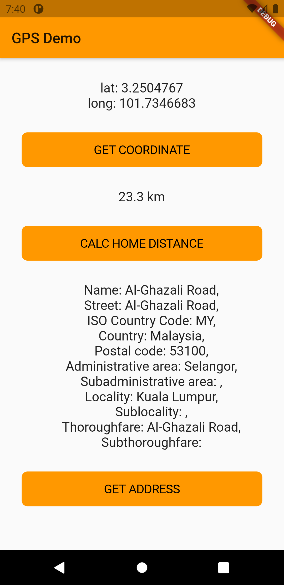

# Testing GPS functionality

A new Flutter project to test the usage of GPS etc.

## App screenshot

## Packages

[cupertino_icons](https://pub.dev/packages/cupertino_icons) (^1.0.1)\
[geolocator](https://pub.dev/packages/geolocator) (^6.1.14)\
[geocoding](https://pub.dev/packages/geocoding) (^1.0.5)

## Download

Please find the app demo from the [**Releases**](https://github.com/iqfareez/test_gps_geocoding_geolocation/releases) page
