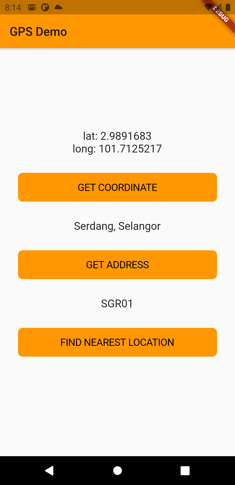

# Testing GPS functionality

A new Flutter project to test the usage of GPS etc.

## App screenshot

# Testing / verification

Check wether the location is correct by comparing to azanpro.com api database.\
Api call: `https://api.azanpro.com/zone/grouped.json?state=<state>`\
Get list of state from [here](http://api.azanpro.com/zone/states.json)\
Example: https://api.azanpro.com/zone/grouped.json?state=PAHANG

## Packages

[cupertino_icons](https://pub.dev/packages/cupertino_icons) (^1.0.1)\
[geolocator](https://pub.dev/packages/geolocator) (^6.1.14)\
[geocoding](https://pub.dev/packages/geocoding) (^1.0.5)

## Download

Please find the app demo from the [**Releases**](https://github.com/iqfareez/test_gps_geocoding_geolocation/releases) page

This app is to test location detection feature that should solve [this issue](https://github.com/iqfareez/App-Waktu-Solat-Malaysia/issues/28) in Malaysia Prayer Time app. Also we are ditching third party API, which is [mpti906](https://mpt.i906.my/api.html)
